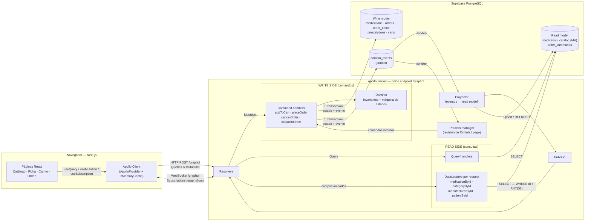
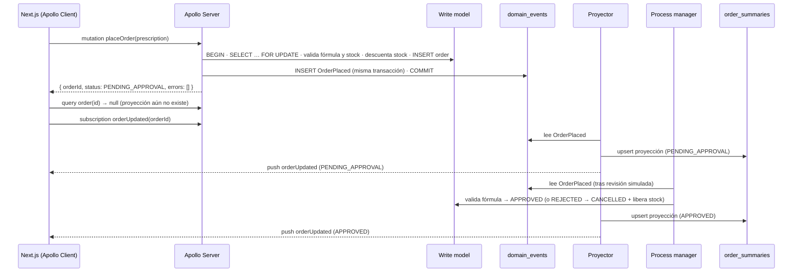

# Afirmative Pill — GraphQL + CQRS para e-commerce farmacéutico

Plataforma de venta de medicamentos en línea donde **toda** la comunicación cliente–servidor
ocurre por **GraphQL** (Zero-REST), con separación estricta de **comandos** (escritura) y
**consultas/proyecciones** (lectura) según el patrón **CQRS**.

| Capa | Tecnología |
|---|---|
| Frontend | Next.js 16 (App Router) + React 19 + **Apollo Client 4** (`ApolloProvider`, `useQuery`, `useMutation`, `useSubscription`) |
| API | **Apollo Server 5** (monolito modular) sobre Express 5 + **graphql-ws** para Subscriptions |
| N+1 | **DataLoader** por request |
| Persistencia | **Supabase PostgreSQL** (conexión directa con `pg`; no se usa la API REST de Supabase) |

---

## 1. Diagrama de arquitectura



**Flujo de una compra:**



---

## 2. Cómo se aplicó CQRS

### Lado de escritura — `backend/src/write/`
- Cada **Mutation es un comando** con intención de negocio: `addToCart`, `updateCartItem`,
  `removeFromCart`, `placeOrder`, `cancelOrder`, `dispatchOrder`. No existen mutaciones CRUD
  genéricas del tipo `updateOrder(status:)`.
- Los handlers ([`commands/orders.ts`](backend/src/write/commands/orders.ts)) siguen siempre este orden:
  **bloquear el agregado → verificar invariantes → mutar el write model → anexar el evento de dominio**,
  todo en **una sola transacción**. Es el patrón *Transactional Outbox*: si el cambio se confirma,
  su evento también.
- **Invariantes farmacéuticas** ([`domain.ts`](backend/src/write/domain.ts)):
  - **Fórmula médica:** si algún ítem tiene `requires_prescription = true`, `placeOrder` sin
    `PrescriptionInput` devuelve `PrescriptionRequiredError`. Una orden **solo puede pasar a
    `APPROVED`** si la fórmula está `VALIDATED` (`canApprove`), y el process manager la revisa:
    registro médico `RM-#####` y fórmula con máximo 30 días.
  - **Stock:** las filas de `medications` se bloquean con `SELECT … FOR UPDATE` en orden de id, para
    evitar deadlocks entre compras concurrentes. Se verifica disponibilidad y se descuenta con
    `UPDATE … WHERE stock >= $qty`. Además, la BD tiene `CHECK (stock >= 0)` como última barrera.
    Si falta stock, se devuelven **todos** los `OutOfStockError` y se hace ROLLBACK.
  - **Máquina de estados:** `PENDING_APPROVAL → APPROVED → DISPATCHED`, y `CANCELLED` solo desde
    los dos primeros estados. Cancelar libera el stock reservado.
- Los errores de negocio **no son excepciones**: viajan tipados en el payload
  (`errors: [UserError!]!`, con `OutOfStockError`, `PrescriptionRequiredError`,
  `InvalidStateTransitionError`, …). Así el cliente puede reaccionar por `code` o por `__typename`.

### Lado de lectura — `backend/src/read/`
- Las Queries **nunca** leen tablas transaccionales de órdenes. Leen de las proyecciones:
  - `medication_catalog`: **vista materializada** desnormalizada, con categoría, laboratorio y un
    texto de búsqueda sin tildes. Tiene índices B-tree por categoría, laboratorio, precio y Rx, y un
    índice **GIN trigram** para búsquedas `LIKE '%…%'`.
  - `order_summaries`: documento listo para la pantalla (total, ítems, historial de estados), que se
    construye plegando (*fold*) los eventos de la orden.
- El **proyector** ([`events/projector.ts`](backend/src/events/projector.ts)) consume `domain_events`,
  actualiza las proyecciones de forma idempotente (`last_event_id`), refresca el catálogo cuando cambia
  el stock y publica cada cambio por PubSub hacia las Subscriptions.

### Consistencia eventual: ¿qué ve el usuario?
| Momento | Write model | Read model | Lo que muestra la UI |
|---|---|---|---|
| Justo después de `placeOrder` | Orden creada, stock descontado | Aún no existe | "Orden recibida…": `order(id)` devuelve `null`, se hace polling cada 1 s y se abre la subscription |
| ~1,5 s después (`PROJECTION_DELAY_MS`) | — | `PENDING_APPROVAL` | Estado pendiente con la nota "Fórmula en revisión" o "Confirmando pago" |
| ~5 s después (`APPROVAL_DELAY_MS`) | `APPROVED` o `CANCELLED` | Se actualiza vía proyector | La subscription empuja el nuevo estado y la vista cambia sola |
| Tras `cancelOrder` / `dispatchOrder` | Estado cambiado | Aún viejo | Banner "Comando aceptado. Esperando proyección…" hasta que llega el evento |
| Catálogo tras una compra | Stock real ya descontado | Stock de la MV algo atrasado | El stock del catálogo es informativo; **el comando siempre valida contra el write model** |

Los retrasos son configurables en `backend/.env` y se amplían a propósito para que la demo los haga visibles.

---

## 3. Cómo se mitigó el problema N+1

Todas las relaciones anidadas se resuelven con **DataLoader** ([`read/loaders.ts`](backend/src/read/loaders.ts)):

| Campo | Loader | Consulta en lote |
|---|---|---|
| `Medication.category` | `categoryById` | `SELECT … FROM categories WHERE id = ANY($1)` |
| `Medication.manufacturer` | `manufacturerById` | `SELECT … FROM manufacturers WHERE id = ANY($1)` |
| `OrderLine.medication`, `CartItem.medication`, `OutOfStockError.medication` | `medicationById` | `SELECT … FROM medication_catalog WHERE id = ANY($1)` |
| `Category.medications`, `Category.medicationCount` | `medicationsByCategory` | `… WHERE category_id = ANY($1)` |
| `Manufacturer.medications` | `medicationsByManufacturer` | `… WHERE manufacturer_id = ANY($1)` |
| `OrderSummary.patient` | `patientById` | `SELECT … FROM patients WHERE id = ANY($1)` |

- **Batching:** las N claves pedidas en el mismo tick del event loop se resuelven con **1 consulta**.
- **Caché por request:** los loaders se crean en el `context` de **cada** request HTTP y de cada
  operación WebSocket. No se comparten datos entre usuarios, y una clave repetida no vuelve a la BD.

**Cómo comprobarlo** (en Apollo Sandbox, `http://localhost:4000/graphql`):

```graphql
query N1Demo {
  medications(page: { limit: 50 }) {
    items { name category { name } manufacturer { name } }
  }
}
```

Sin DataLoader serían 1 + 50 + 50 = **101 consultas**. En la consola del servidor se ven **3**:

```
▶ QUERY N1Demo
  [SQL catalog.search] 45ms rows=50 :: SELECT id, sku, name, …
[DataLoader] categoryById: 14 clave(s) agrupadas en 1 consulta → [2, 3, 1, …]
  [SQL catalog.categoriesByIds] 20ms rows=14 :: SELECT id, name, slug FROM categories WHERE id = ANY($1::int[])
[DataLoader] manufacturerById: 21 clave(s) agrupadas en 1 consulta → […]
  [SQL catalog.manufacturersByIds] 21ms rows=21 :: SELECT id, name FROM manufacturers WHERE id = ANY($1::int[])
```

---

## 4. Decisiones de diseño del schema

- **Scalars personalizados:** `Money` (entero COP; evita errores de coma flotante con dinero),
  `PositiveInt` (las cantidades ≤ 0 se rechazan antes de llegar al dominio), `Date` y `DateTime`.
- **Enums** para todo valor cerrado (`OrderStatus`, `PrescriptionStatus`, `StockLevel`, `UserErrorCode`, …).
- **Inputs dedicados** por comando (`AddToCartInput`, `PlaceOrderInput`, `PrescriptionInput`, …):
  el contrato de cada intención puede evolucionar de forma independiente.
- **Payloads con errores tipados** (`interface UserError` + implementaciones concretas): los errores
  de negocio forman parte del contrato. Los errores de GraphQL quedan para fallos técnicos.
- **`PlaceOrderPayload` no devuelve la orden completa.** Solo devuelve el acuse (`orderId`, `status`,
  `acceptedAt`) y el carrito nuevo. En CQRS el comando no lee del read model; la vista de la orden
  se obtiene con `Query.order` o `Subscription.orderUpdated`.
- **Vista condensada vs. ficha.** `Medication` expone todos los campos, pero la query del catálogo
  pide solo `id name presentation price requiresPrescription stockLevel`. El over-fetching se evita
  desde el cliente, sin endpoints "light" y "full".
- **`stockLevel`** permite mostrar disponibilidad sin depender de la cifra exacta.
- **Paciente fijo:** el `context` inyecta un paciente demo. Cambiarlo por JWT solo tocaría
  `graphql/context.ts`.

El SDL completo está en [`backend/schema.graphql`](backend/schema.graphql) y se reproduce al final de este documento.

---

## 5. Zero-REST

- El servidor monta **una sola ruta**: `/graphql`, que atiende HTTP para queries y mutations y
  WebSocket para subscriptions. Cualquier otra ruta responde 404.
- El frontend no usa `fetch` directo ni route handlers de Next: todo pasa por Apollo Client.
- Supabase se usa **solo como PostgreSQL**, con conexión TCP desde el backend. No se usan
  `supabase-js` ni PostgREST.

---

## 6. Puesta en marcha

Requisitos: Node 20+ y un proyecto de Supabase.

```bash
# 1) Backend
cd backend
npm install
cp .env.example .env      # pega la connection string del "Shared pooler" (puerto 5432)
npm run db:setup          # crea tablas, vista materializada, índices y carga los 50 medicamentos
npm run dev               # http://localhost:4000/graphql  (Apollo Sandbox en el navegador)

# 2) Frontend (otra terminal)
cd frontend
npm install
npm run dev               # http://localhost:3000
```

### Datos útiles para la demo
- **Fórmula válida:** médico cualquiera, registro `RM-12345` y fecha de hoy. La orden pasa a `APPROVED` en ~5 s.
- **Fórmula rechazada:** registro `12-ABC` o una fecha de hace más de 30 días. La orden pasa a
  `CANCELLED` y el stock se libera.
- **Stock insuficiente:** agrega más unidades de las disponibles, o compra en dos pestañas a la vez
  el último stock de un producto.
- **Despacho:** en una orden `APPROVED`, usa el botón "Despachar (simular farmacia)".

---

## 7. Estructura del repositorio

```
backend/
  schema.graphql              Contrato SDL completo
  db/migrations/              001 write model · 002 read model (MV + índices)
  db/seed/medications.csv     Dataset de 50 medicamentos
  db/setup.ts                 Migración + seed idempotentes
  src/
    index.ts                  Apollo Server + graphql-ws en /graphql (única ruta)
    graphql/                  resolvers, scalars, context
    write/                    CQRS — comandos, dominio, eventos
    read/                     CQRS — consultas y DataLoaders
    events/                   proyector, process manager, pubsub
frontend/
  src/lib/apollo.ts           ApolloClient (split HTTP/WS) + typePolicies
  src/app/providers.tsx       ApolloProvider en la raíz
  src/graphql/operations.ts   Queries, mutations, subscriptions y fragments
  src/app/…                   Catálogo, ficha, carrito, órdenes
```

---

## Anexo — Schema SDL completo (`backend/schema.graphql`)

```graphql
"""
Afirmative Pill — contrato GraphQL único entre clientes y backend (Zero-REST).

Organización CQRS del contrato:
  • Query        → lado de LECTURA. Resuelve contra proyecciones optimizadas (medication_catalog, order_summaries).
  • Mutation     → lado de ESCRITURA. Cada campo es un COMANDO que expresa una intención de negocio
                   y devuelve un Payload con errores de dominio tipados (no excepciones genéricas).
  • Subscription → notificaciones cuando una proyección cambia (consistencia eventual en tiempo real).
"""
schema {
  query: Query
  mutation: Mutation
  subscription: Subscription
}

# =====================================================================
# SCALARS PERSONALIZADOS
# =====================================================================

"Instante en formato ISO-8601 con zona horaria, p. ej. 2026-09-24T18:30:00.000Z"
scalar DateTime

"Fecha de calendario ISO-8601 sin hora, p. ej. 2026-09-24"
scalar Date

"Valor monetario en pesos colombianos (COP) como entero no negativo, sin decimales."
scalar Money

"Entero estrictamente mayor que cero (cantidades, límites de paginación)."
scalar PositiveInt

# =====================================================================
# ENUMS
# =====================================================================

"Ciclo de vida operacional de una orden."
enum OrderStatus {
  "Orden creada y stock reservado; esperando validación de fórmula y/o confirmación de pago."
  PENDING_APPROVAL
  "Fórmula validada (si aplica) y pago confirmado. Lista para despacho."
  APPROVED
  "La farmacia despachó la orden."
  DISPATCHED
  "Orden cancelada por el paciente o por rechazo de la fórmula. El stock fue liberado."
  CANCELLED
}

"Estado de la fórmula médica asociada a una orden."
enum PrescriptionStatus {
  "Ningún ítem de la orden exige fórmula (venta libre / OTC)."
  NOT_REQUIRED
  "Fórmula recibida; en revisión por el químico farmacéutico."
  SUBMITTED
  "Fórmula verificada y aceptada."
  VALIDATED
  "Fórmula inválida o vencida. La orden se cancela."
  REJECTED
}

"Nivel de disponibilidad para mostrar al paciente sin exponer cifras exactas si no se desea."
enum StockLevel {
  IN_STOCK
  LOW_STOCK
  OUT_OF_STOCK
}

enum MedicationSortField {
  NAME
  PRICE
  STOCK
}

enum SortDirection {
  ASC
  DESC
}

"Códigos estables de error de dominio para que el cliente reaccione programáticamente."
enum UserErrorCode {
  VALIDATION_FAILED
  NOT_FOUND
  OUT_OF_STOCK
  EMPTY_CART
  PRESCRIPTION_REQUIRED
  INVALID_STATE_TRANSITION
}

# =====================================================================
# LECTURA — TIPOS DEL READ MODEL
# =====================================================================

type Medication {
  id: ID!
  sku: String!
  "Nombre comercial."
  name: String!
  "Principio activo (DCI)."
  activeIngredient: String!
  "Concentración, p. ej. '500 mg'."
  dosage: String!
  "Forma farmacéutica y empaque, p. ej. 'Caja x 20 tabletas'."
  presentation: String!
  price: Money!
  "Unidades disponibles según la última proyección (puede ir ligeramente atrasado respecto al write model)."
  stock: Int!
  stockLevel: StockLevel!
  requiresPrescription: Boolean!
  "Indicaciones clínicas."
  description: String!
  "Resuelto con DataLoader (batch por request)."
  category: Category!
  "Resuelto con DataLoader (batch por request)."
  manufacturer: Manufacturer!
}

"Categoría terapéutica."
type Category {
  id: ID!
  name: String!
  slug: String!
  medicationCount: Int!
  "Resuelto con DataLoader: todas las categorías pedidas se cargan en una sola consulta."
  medications(limit: PositiveInt = 20): [Medication!]!
}

"Laboratorio fabricante."
type Manufacturer {
  id: ID!
  name: String!
  medications(limit: PositiveInt = 20): [Medication!]!
}

type MedicationPage {
  items: [Medication!]!
  totalCount: Int!
  hasMore: Boolean!
}

type Patient {
  id: ID!
  fullName: String!
  documentId: String!
  email: String!
}

type CartItem {
  medication: Medication!
  quantity: PositiveInt!
  lineTotal: Money!
}

type Cart {
  id: ID!
  items: [CartItem!]!
  itemCount: Int!
  subtotal: Money!
  "true si al menos un ítem exige fórmula médica: el checkout pedirá PrescriptionInput."
  requiresPrescription: Boolean!
  prescriptionRequiredFor: [Medication!]!
}

"Línea de la proyección de una orden. El precio quedó congelado al momento de la compra."
type OrderLine {
  medication: Medication!
  quantity: PositiveInt!
  unitPrice: Money!
  subtotal: Money!
}

type StatusChange {
  status: OrderStatus!
  at: DateTime!
  note: String
}

"""
PROYECCIÓN de lectura de una orden (tabla order_summaries).
Se construye de forma asíncrona a partir de los eventos de dominio, por lo que
puede no existir aún justo después de ejecutar placeOrder (consistencia eventual).
"""
type OrderSummary {
  id: ID!
  status: OrderStatus!
  prescriptionStatus: PrescriptionStatus!
  "Explicación legible del último cambio (p. ej. motivo de rechazo o cancelación)."
  statusNote: String
  totalAmount: Money!
  itemCount: Int!
  items: [OrderLine!]!
  statusHistory: [StatusChange!]!
  placedAt: DateTime!
  updatedAt: DateTime!
  "true si la orden ya no cambiará de estado (DISPATCHED o CANCELLED)."
  isFinal: Boolean!
  patient: Patient!
}

# =====================================================================
# INPUTS
# =====================================================================

input MedicationFilter {
  "Búsqueda libre sin tildes ni mayúsculas sobre nombre comercial, principio activo, categoría y laboratorio."
  search: String
  activeIngredient: String
  categoryId: ID
  manufacturerId: ID
  requiresPrescription: Boolean
  inStockOnly: Boolean = false
  minPrice: Money
  maxPrice: Money
}

input MedicationSort {
  field: MedicationSortField! = NAME
  direction: SortDirection! = ASC
}

input PageInput {
  limit: PositiveInt! = 20
  offset: Int! = 0
}

input AddToCartInput {
  medicationId: ID!
  quantity: PositiveInt! = 1
}

input UpdateCartItemInput {
  medicationId: ID!
  "Nueva cantidad absoluta."
  quantity: PositiveInt!
}

input RemoveFromCartInput {
  medicationId: ID!
}

"Información de soporte de la fórmula médica."
input PrescriptionInput {
  doctorName: String!
  "Registro médico del prescriptor, formato RM-12345."
  doctorLicense: String!
  "Fecha de emisión; debe tener máximo 30 días y no estar en el futuro."
  issuedAt: Date!
  diagnosis: String
  "URL del soporte escaneado (opcional)."
  documentUrl: String
}

input PlaceOrderInput {
  "Obligatoria si algún ítem del carrito tiene requiresPrescription = true."
  prescription: PrescriptionInput
}

input CancelOrderInput {
  orderId: ID!
  reason: String
}

input DispatchOrderInput {
  orderId: ID!
}

# =====================================================================
# ESCRITURA — ERRORES DE DOMINIO Y PAYLOADS
# =====================================================================

"Error de negocio esperado. Se devuelve en el payload, no como error de GraphQL."
interface UserError {
  code: UserErrorCode!
  message: String!
  "Ruta del input que causó el error, p. ej. ['prescription', 'issuedAt']."
  field: [String!]
}

type ValidationError implements UserError {
  code: UserErrorCode!
  message: String!
  field: [String!]
}

type NotFoundError implements UserError {
  code: UserErrorCode!
  message: String!
  field: [String!]
}

type EmptyCartError implements UserError {
  code: UserErrorCode!
  message: String!
  field: [String!]
}

"Invariante: no se vende lo que no hay en bodega."
type OutOfStockError implements UserError {
  code: UserErrorCode!
  message: String!
  field: [String!]
  medication: Medication!
  requested: Int!
  available: Int!
}

"Invariante: medicamentos con fórmula no se venden sin soporte médico."
type PrescriptionRequiredError implements UserError {
  code: UserErrorCode!
  message: String!
  field: [String!]
  medications: [Medication!]!
}

"Invariante: la máquina de estados de la orden solo permite transiciones válidas."
type InvalidStateTransitionError implements UserError {
  code: UserErrorCode!
  message: String!
  field: [String!]
  currentStatus: OrderStatus!
  attemptedStatus: OrderStatus!
}

type CartPayload {
  cart: Cart
  errors: [UserError!]!
}

"""
Acuse del comando placeOrder. Solo confirma que el comando fue aceptado y la orden
quedó registrada (write model). El detalle legible vive en la proyección:
consúltalo con Query.order(id) o suscríbete a Subscription.orderUpdated(orderId).
"""
type PlaceOrderPayload {
  orderId: ID
  status: OrderStatus
  acceptedAt: DateTime
  "Carrito nuevo (vacío) tras el checkout, para actualizar la caché del cliente."
  cart: Cart
  errors: [UserError!]!
}

type OrderCommandPayload {
  orderId: ID
  status: OrderStatus
  errors: [UserError!]!
}

# =====================================================================
# OPERACIONES RAÍZ
# =====================================================================

type Query {
  "Catálogo paginado con filtros facetados. Pide solo los campos que la vista necesita."
  medications(
    filter: MedicationFilter
    sort: MedicationSort = { field: NAME, direction: ASC }
    page: PageInput = { limit: 20, offset: 0 }
  ): MedicationPage!

  "Ficha técnica de un medicamento."
  medication(id: ID!): Medication

  categories: [Category!]!
  manufacturers: [Manufacturer!]!

  "Paciente autenticado (en la demo, un paciente fijo inyectado en el contexto)."
  me: Patient!

  "Carrito activo del paciente."
  cart: Cart!

  "Proyección de una orden. null mientras el proyector aún no la ha materializado."
  order(id: ID!): OrderSummary

  myOrders(status: OrderStatus, page: PageInput = { limit: 20, offset: 0 }): [OrderSummary!]!
}

type Mutation {
  "Agrega unidades de un medicamento al carrito (valida existencia y stock disponible)."
  addToCart(input: AddToCartInput!): CartPayload!
  "Fija la cantidad de un ítem del carrito."
  updateCartItem(input: UpdateCartItemInput!): CartPayload!
  removeFromCart(input: RemoveFromCartInput!): CartPayload!

  """
  Convierte el carrito en una orden. En UNA transacción: exige fórmula si aplica,
  reserva stock de forma atómica (bloqueo de filas) y registra el evento OrderPlaced.
  """
  placeOrder(input: PlaceOrderInput = {}): PlaceOrderPayload!

  "Cancela una orden PENDING_APPROVAL o APPROVED y libera el stock reservado."
  cancelOrder(input: CancelOrderInput!): OrderCommandPayload!

  "Operación de farmacia: marca como despachada una orden APPROVED."
  dispatchOrder(input: DispatchOrderInput!): OrderCommandPayload!
}

type Subscription {
  "Emite la proyección actualizada cada vez que cambia una orden concreta."
  orderUpdated(orderId: ID!): OrderSummary!
  "Emite cualquier cambio en las órdenes del paciente actual."
  myOrdersUpdated: OrderSummary!
}
```
